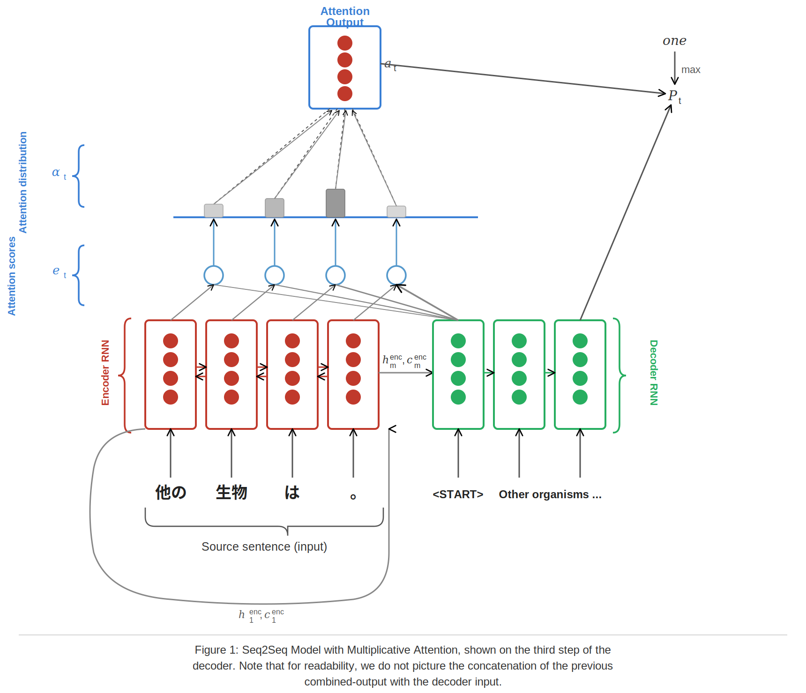
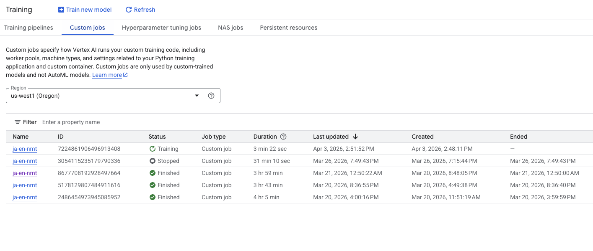
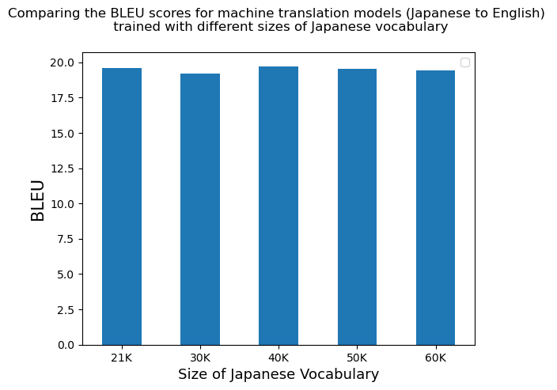

# Japanese-English Neural Machine Translation (NMT)

This project is an extension of the Cherokee-to-English translation project from the Stanford Online NLP course (XCS224N).


My own objectives for this project were to mostly pick up skills in using Vertex AI, become more familiar with the GCP product lineup, and using the gcloud CLI so that I can submit training jobs from my laptop. I was also interested in digging a little deeper into the Cherokee-to-English neural translation model, which was presented in an assignment from Stanford, and whether the architecture is also effective at a language like Japanese (more characters, and words are not separated by spaces). 


The model architecture features a bi-directional LSTM encoder, and a uni-directional LSTM decoder with multiplicative attention.



# Model Training

From the original code base developed by Stanford, a few changes have been made:
* Instead of Cherokee to English, the model is trained to translate Japanese to English (corpus data from OPUS) 
* Models were trained with varying vocabulary sizes (21K, 30K, 40K, 50K) -- I was mainly interested in seeing if changing the vocab size will dramatically improve performance for Japanese (which is a language with many characters)
* Model training was done with Google's Vertex AI custom training job 
    * Using a single Nvidia Tesla V100 GPU instance, each training run took me about 4 hours to complete 
    * An attempt to train this NMT model with the RTX4070 in my gaming desktop failed due to insufficient VRAM, which I found to be interesting because the training data is only 41MB large and the GPU has 12GB of VRAM  
    * I imagine the training time can be reduced through a multi-GPU setup, but that's a more sophisticated approach and would require me to alter the training code
* The original code had preset hyperparameters, but I implemented a tuning sweep to trial learning rate, dropout rate, and batch size using Vertex AI hyperparameter tuning jobs


# Conclusion

So does changing the vocab size affect the translation performance? 

> TLDR; the BLEU scores do not show any improvements with respect to vocabulary size. I asked CLaude about this, confirming that expanding the vocabulary size only helps up to a certain point (of about 32K) and can actually degrade the performance if too large. 



A few issues are already noticeable from the test outputs below:

* Some of the phrases are being repeated in the translated output. I wonder if tweaking the beam search in the decoder to predict the next token could improve this. 
* Japanese is not strict about composing sentences with a subject-predicate structure, which makes the translated English output invalid as a sentence. The last source sentence from below is an example. 


```python 
[Source Sentences] ==================================================
['古代より皇位を象徴するものとしていわゆる三種の神器が挙げられる。',
 '当時の「蜀大字本」の規格の文字により、毎行14字の巻子本形式であった。',
 '池田亀鑑は、約300点、冊数にして約15,000冊の写本を調査し、写本を撮影したフィルムは約50万枚に及ぶとされている。',
 '1399年に大内氏が蜂起した応永の乱でも戦う。',
 '美濃国の徳山氏の祖と伝える。',
 '静「吉野の山中ではなく、その僧坊である。',
 '話題となった。',
 '大雲寺（だいうんじ）は、京都市左京区岩倉にある単立（天台証門宗）の寺院。',
 '1441年(嘉吉1)には6代将軍の足利義教が家臣の赤松満祐親子により暗殺される嘉吉の乱が起こる。',
 '心に暴を調え、心の曲がるのを直し、心が散るのを定める、の意。']

 [21K Vocabulary] ==================================================
 ['The Three Sacred Treasures of the Three Sacred Treasures of the Three Sacred Treasures of the Three Sacred Treasures of the Imperial Family symbolized the Imperial Throne.',
 "Due to the standard of the standard of 'Aza-Oaza Hon' at that time, it was one of the 14 letters of each line.",
 'It is said that Kikan IKEDA investigated the manuscripts of about 300 books and a total of about 50 thousand copies of the book, which is said to be about 500,000.',
 'In 1399, the Ouchi clan fought against the Oei War.',
 'He is said to have been the founder of the Tokuyama clan in Mino Province.',
 'It is not the mountain in Yoshino, but it is a priestbo.',
 'It became a topic.',
 'Daiun-ji Temple is a Buddhist temple located in Iwakura, Sakyo Ward, Kyoto City.',
 'In 1441, the sixth shogun Yoshinori ASHIKAGA was assassinated by his vassal Mitsusuke AKAMATSU.',
 'It means to give a storm to the heart, and the heart of the mind will be found.']

 [30K Vocabulary] ==================================================
 ['The so-called Three Sacred Treasures of the Three Sacred Treasures of the Imperial Family, which symbolize the Imperial Throne from ancient times.',
 "Due to the standard of the standard of 'Zaza Hon' at that time, it was a form of Kansubon in 14 letters.",
 'It is said that Kikan IKEDA investigated the manuscripts of about 15,000 copies, and the film that had been shot by the manuscript was about 500,000.',
 'In 1399, he fought in the Oei War where the Ouchi clan rose in revolt.',
 'It is said that he was the founder of the Tokuyama clan in Mino Province.',
 'He was not a monk in the mountains of Yoshino, but was a priest.',
 'It became a topic.',
 'Daiun-ji Temple is an independent temple (Tendaishomon Sect) in Iwakura, Sakyo Ward, Kyoto City.',
 'In 1441, the Kakitsu Incident occurred when the sixth Shogun Yoshinori ASHIKAGA was assassinated by his vassal Mitsusuke AKAMATSU.',
 'It means to make a storm in the heart and the heart of the mind will be stabbed.']

 [40K Vocabulary] ==================================================
 ['The so-called Three Sacred Treasures of the Three Sacred Treasures of the Three Sacred Treasures of the Imperial Family.',
 "According to the standard letter of 'Shusho' at that time, it was a Kansubon style of 14 letters.",
 'Kikan IKEDA investigated about 15,000 copies of manuscripts, and the film shot by the manuscript was about 500,000.',
 'In 1399, the Ouchi clan fought in the Oei War.',
 'It is said that he was the founder of the Tokuyama clan in Mino Province.',
 'Shizuka, a priest of Shizuka, was a priest.',
 'It was a topic.',
 'Daiun-ji Temple is an independent temple (Tendai Shomon Sect) located in Iwakura, Sakyo Ward, Kyoto City.',
 'In 1441, the sixth Shogun Yoshinori ASHIKAGA was assassinated by his vassal Mitsusuke AKAMATSU and his son Mitsusuke AKAMATSU.',
 'It means to chose a tyranny in mind and the heart of the mind is to determine.']

 [50K Vocabulary] ==================================================
 ['The Three Sacred Treasures of the Three Sacred Treasures of the Three Sacred Treasures of the Three Sacred Treasures of the Imperial Family in ancient times.',
 'It was a type of Kansubon (sub-subsequence style scroll) with fourteen letters of each line.',
 'Kikan IKEDA investigated about 300 thousand copies of the book, which was about about 300 thousand copies of the book.',
 'He fought against the Ouchi clan in the Oei War in 1399.',
 'He is said to have been the founder of the Tokuyama clan in Mino Province.',
 'It is not the mountain in Yoshino, but a priestbo.',
 'This was a topic.',
 'Daiun-ji Temple is an independent temple in Iwakura, Sakyo Ward, Kyoto City.',
 'In 1441, the sixth Shogun Yoshinori ASHIKAGA was assassinated by his vassal Mitsusuke AKAMATSU and the Kakitsu War.',
 'It means the tyranny of your heart and the heart of the heart can be detected.']

 [60K Vocabulary] ==================================================
 ['The three sacred imperial treasures that symbolize the Imperial Throne since ancient times.',
 "According to the standard letter of 'Sho-Oaza Hon' at that time, the style of Kansubon (a style of writing style) of 14 letters was held every year.",
 'It is said that Kikan IKEDA examined about 300 books and a total of about 15,000 books, and the film was about 500,000.',
 'In 1399, the Ouchi clan fought against the Oei War which broke out.',
 'He was the founder of the Tokuyama clan in Mino Province.',
 "Shizuka is not the Yamanaka in Yoshino, and it is a sobo (priest's living quarters).",
 'He was a topic.',
 'Daiun-ji Temple is a temple located in Iwakura, Sakyo Ward, Kyoto City.',
 'In 1441, the Kakitsu War occurred due to his vassal Mitsusuke AKAMATSU and his son Mitsusuke AKAMATSU.',
 'In your heart, the heart of the hearts fall and the hearts fall.']

```


# Finally

I skipped some of things that would have made this a more complete portfolio type of project because I didn't see a point, and it would have costed money:

* Each of the training runs on the Nvidia Tesla V100 costed me $15 
* Hosting the model endpoint on Vertex AI, to enable real-time interactions with the model, would be easy
* I think the more meaningful and difficult aspects of building good neural network systems has everything to do with being able to understand and tweak the mathematical architecture -- which was the hard part of understanding this entire code base


